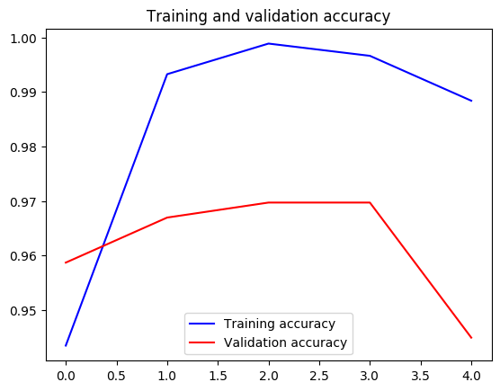
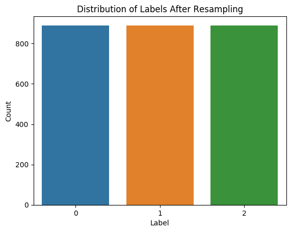
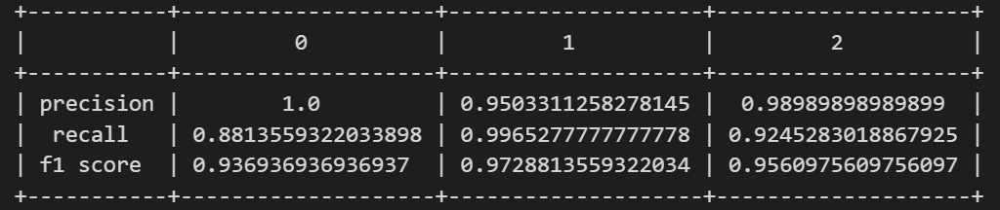
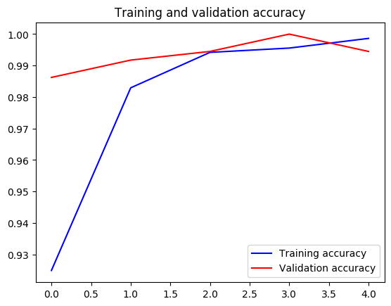
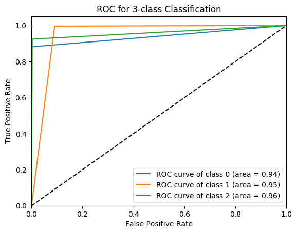
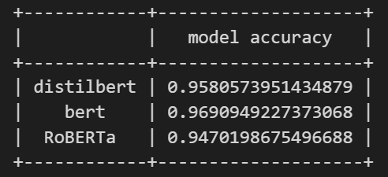

# Financial-Sentiment-Analysis-with-BERT-Transfer-Learning
This project utilizes BERT transfer learning to classify sentiment in financial texts


## Project Overview
This project focuses on performing sentiment analysis on sentences from the financial domain using transfer learning with the BERT (Bidirectional Encoder Representations from Transformers) model. The objective is to develop a model that can accurately classify the sentiment of financial phrases as Negative, Neutral, or Positive.

## Data
The Financial PhraseBank dataset, a collection of hand-annotated sentences with sentiment labels, is utilized in this project. The dataset offers various "flavors" or subsets based on the level of agreement among annotators. For the basic part of the project, the "all agree" flavor is used.

[Financial PhraseBank - Hugging Face](https://huggingface.co/datasets/financial_phrasebank)

## Transfer Learning Approach
The project leverages transfer learning, which involves using a pre-trained BERT model and adapting it to the specific task of financial sentiment analysis. The main steps include:

Loading a pre-trained BERT model from the HuggingFace platform.
Freezing certain layers of the BERT model to retain the learned representations.
Adding a custom classification head on top of the frozen BERT layers.
Fine-tuning the model on the Financial PhraseBank dataset.
By freezing layers of the BERT model, the project aims to utilize the powerful language understanding capabilities of BERT while reducing the computational overhead and preventing overfitting to the specific domain.


## Project Outline
```
Financial Sentiment Analysis with BERT Transfer Learning
|
├── Initial Setup
| ├── Installation of Required Packages
| ├── GPU Availability Check
| └── TensorFlow Version Verification
|
├── Modeling Pipeline (Part I)
| ├── Data Acquisition
| | └── Importing HuggingFace Dataset
| ├── Data Analysis
| | └── Exploratory Data Analysis
| ├── Data Preparation
| | ├── Transformation
| | ├── Tokenization
| | └── Addressing Imbalanced Data Issues
| └── Model Training
| ├── Training the Classifier Head
| ├── Training All Layers
| └── Error Analysis
|
└── Performance Enhancement (Part II)
├── Advanced Data Handling
| └── TensorFlow Dataset (TFDS) Integration
├── Data Imbalance
├── Model Architecture
| └── Custom Classification Head Design
├── In-Depth Error Analysis
├── Dataset Variation
| └── Utilizing Different Dataset "Flavors"
├── Pre-Trained Model Experimentation
| └── Testing Various Pre-Trained Models
└── Fine-Tuning
└── Experiment with Few-shot Learning
```

### Analysis and Results
Part I of the Financial Sentiment Analysis with BERT Transfer Learning project demonstrated the model's success in sentiment classification. The model achieved high precision, recall, and F1 scores across all sentiment classes after addressing data imbalance through resampling techniques. The training and validation accuracy graph 

showed consistent learning without overfitting, and the model generalized well to unseen data. The label distribution after resampling  
was uniform, contributing to the model's robustness.

In Part II, oversampling strategies and TensorFlow datasets were incorporated, further enhancing the model's performance. The precision-recall table

indicated high precision across all classes, with slightly lower recall for the negative class. The training-validation accuracy graph 

showed stable learning and robust validation. Experiments with a 66% agreed dataset yielded 85-90% accuracy, highlighting the model's ability to approximate human judgment. The ROC curve 

demonstrated the model's excellent classification capabilities, with AUC values close to 1 for all classes.

Comparative analysis of transformer models like DistilBERT, BERT, and RoBERTa revealed high accuracy results, with BERT slightly outperforming the others. 

The project also investigated the impact of training size on model performance, observing a sharp drop in accuracy below 100 training samples. This suggests that a minimum of 100 training samples could be the sweet spot for maintaining high accuracy with the DistilBERT architecture in financial sentiment analysis tasks.

## Requirements
Please refer to `requirements.txt` for a complete list of dependencies.